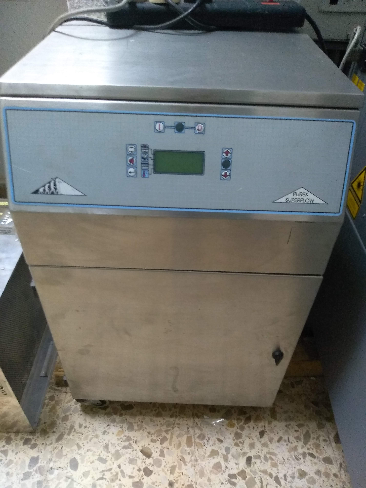
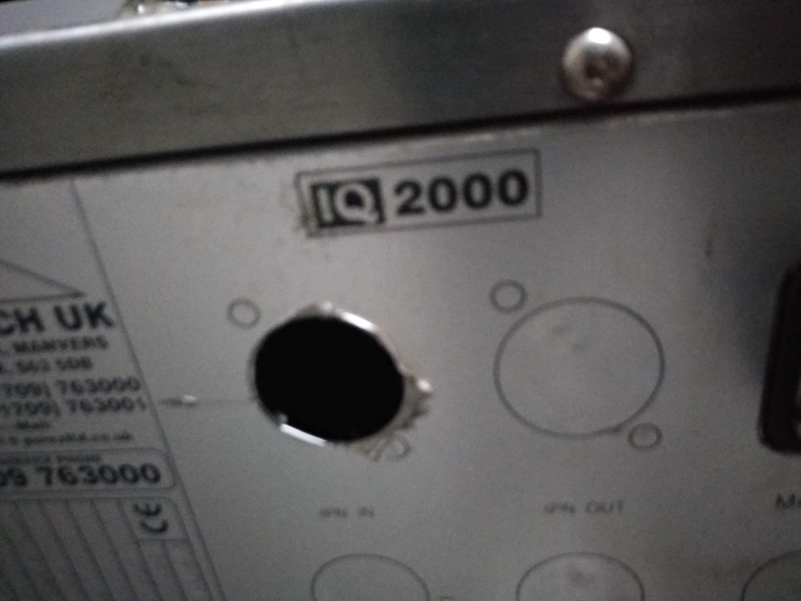
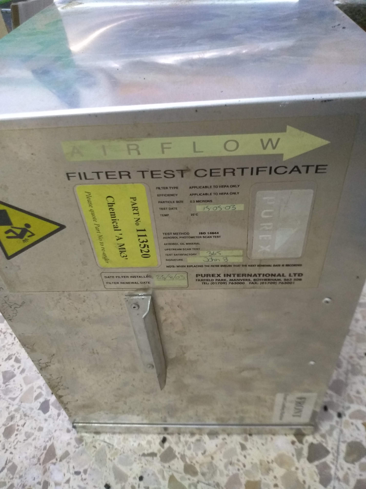
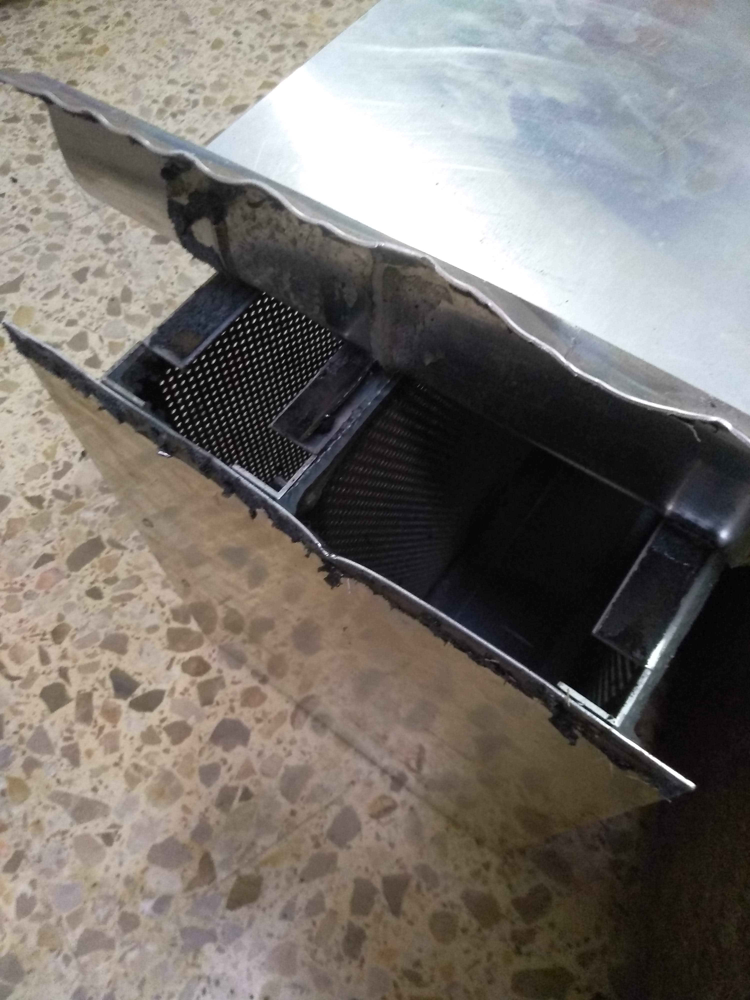
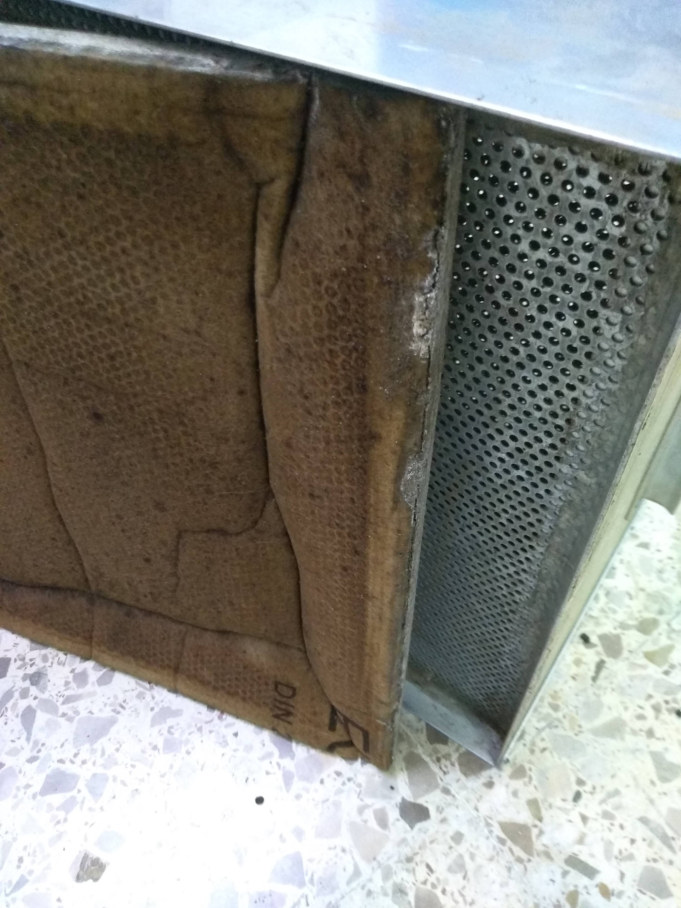
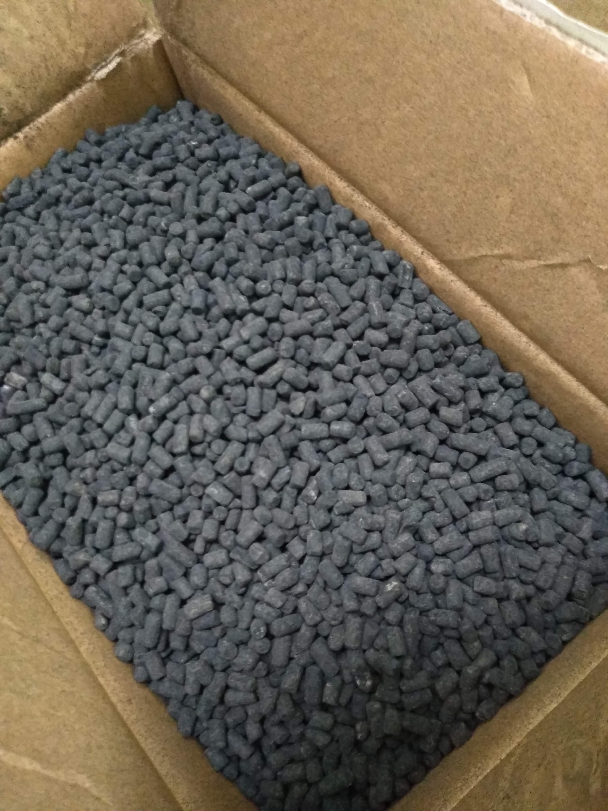

# Purex IQ2000 filter details

This machines go from 60 to 800 euros on ebay.

## filter replacement

mine came with 113520 Chemical 'A mk3' filter.

It appears to have a pre filter and then activated charcoal pellets.

Closest I could find to a replacement was 113508

336 euro from https://www.shopaessolutions.co.uk/purex-113508-chemical-filter.html

I have no answers from purex or the shop linked above about the suitability of 113508 so I'm trying a home replacement

## inside the filter

External dimensions of the box are 365x365x260mm 

The box is glued together with some strong double sided sticky tape.

Pre filter is about 360mm square and 15mm thick.

5kg of pellets inside.

## refilling the filter

I was able to find 5kg of activated charcoal pellets for fish pump filters for 50 euro including delivery.

The pre-filter is in such a bad condition I'm not sure what it should be replaced with. 

https://www.generalfilter.com/en/norms/en-7792012/

I assume it shouldn't be too fine or it will clog too quickly and stop air flow.
I found some that is rated G4 (gross class) for 20 euros for 2 sq meters, so should be able to make 8 replacements from the roll.

https://www.amazon.es/gp/product/B073R4HF7N/ref=ppx_yo_dt_b_asin_title_o00_s00?ie=UTF8&psc=1
